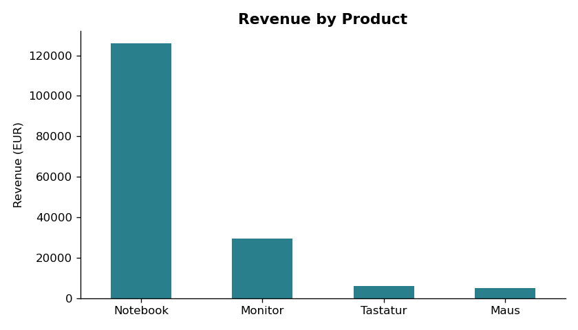
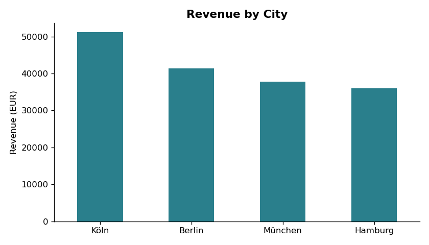
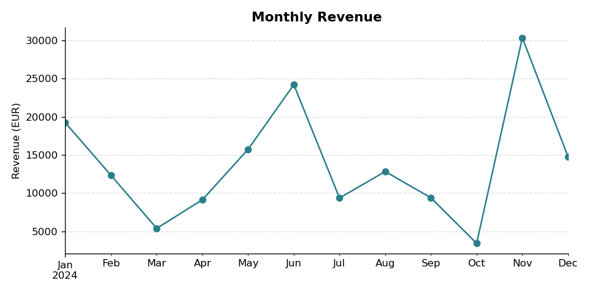

# Sales Report

*Automatically generated on 2026-07-13 14:15*

Reporting period: **2024-01-01** to **2024-12-24**

## Key figures

| Metric | Value |
|---|---|
| Total revenue | 166,217.00 EUR |
| Total orders | 199 |
| Average order value | 835.26 EUR |

## Revenue by product

| Product | Revenue (EUR) |
|---|---|
| Notebook | 125,860.00 |
| Monitor | 29,452.00 |
| Tastatur | 5,880.00 |
| Maus | 5,025.00 |

## Revenue by city

| City | Revenue (EUR) |
|---|---|
| Köln | 51,156.00 |
| Berlin | 41,355.00 |
| München | 37,744.00 |
| Hamburg | 35,962.00 |

## Monthly revenue trend

