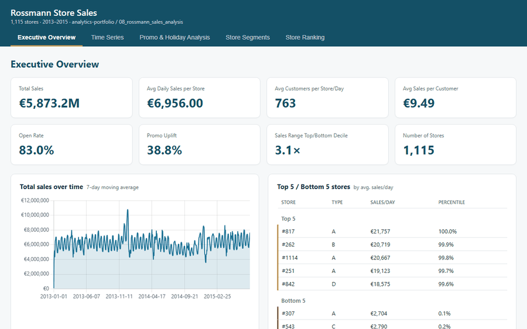

# Rossmann Store Sales — Analysis Pipeline

Exploratory data analysis of the [Rossmann Store Sales](https://www.kaggle.com/c/rossmann-store-sales)
dataset (1,017,209 sales rows, 1,115 stores). The pipeline answers six
strategic questions and exports prepared CSVs for the dashboard.

## Presentations

[](https://susannschmelzer29-lab.github.io/analytics-portfolio/08_rossmann_sales_analysis/dashboard/index.html)

*Animated preview of the five dashboard pages — **[open the live interactive version →](https://susannschmelzer29-lab.github.io/analytics-portfolio/08_rossmann_sales_analysis/dashboard/index.html)***

| | |
|---|---|
| **🎤 Narrated presentation** | _to be added_ |
| **🖥️ Interactive dashboard (live)** | [View on GitHub Pages →](https://susannschmelzer29-lab.github.io/analytics-portfolio/08_rossmann_sales_analysis/dashboard/index.html) |
| **🖥️ Interactive dashboard (source)** | [`dashboard/index.html`](dashboard/index.html) — standalone HTML/JS build, open directly in a browser |

## Contents

| Question | Output |
|-------|--------|
| Store ranking by daily sales | `q1_store_ranking.csv` |
| Effect of competition proximity | `q2_competition_distance.csv` |
| Seasonality (month / weekday) | `q3_seasonality_*.csv` |
| Holidays & school holidays | `q4_*.csv` |
| Promo uplift | `q5_promo*.csv` |
| Store type & assortment | `q6_*.csv` |
| Management KPIs | `kpi_management.csv` |

Additionally: `rossmann_master_tableau.csv` (full master dataset, ~165 MB, is
**not** checked in, but generated locally).

## Getting the data

The raw data is not in the repo due to its size. Only `data/train_sample.csv`
(2,000 rows) is included as a preview.

1. Download the data from Kaggle: `train.csv`, `store.csv` (optionally `test.csv`).
2. Place them in the `data/` folder.

## Run locally (without Docker)

```powershell
pip install -r requirements.txt
jupyter nbconvert --to notebook --execute --output executed.ipynb rossmann_sales_analysis.ipynb
python check_results.py
```

## With Docker

**Build the image:**

```powershell
docker build -t rossmann-sales-analysis .
```

**Run the pipeline headless** (default — generates all CSVs in `output/`):

```powershell
docker run --rm -v ${PWD}/data:/app/data -v ${PWD}/output:/app/output rossmann-sales-analysis
```

**Start JupyterLab in the container** (interactive notebook in the browser):

```powershell
docker run --rm -p 8888:8888 -v ${PWD}/data:/app/data -v ${PWD}/output:/app/output rossmann-sales-analysis jupyter lab --ip=0.0.0.0 --port=8888 --no-browser --allow-root
```

Then open the URL shown in the terminal (`http://127.0.0.1:8888/lab?token=...`) in your browser.

## Project structure

```
.
├── rossmann_sales_analysis.ipynb            # core analysis
├── run_pipeline.py                          # headless runner (Docker default)
├── check_results.py                         # QA check of the master CSV
├── requirements.txt
├── Dockerfile
├── .dockerignore / .gitignore
├── data/                                     # raw data (mounted) + sample
├── output/                                   # generated CSVs (not in repo)
└── figures/                                  # generated charts (not in repo)
```
